# GCP Cloud Infrastructure Lab

Hands-on Google Cloud infrastructure lab focused on **Cloud Infrastructure, Linux, Networking, IAM, Storage, Monitoring, Logging and backup operations**.

This project simulates a small corporate environment running on Google Cloud Platform, with a custom network, Linux web server, controlled access, backup to Cloud Storage and basic observability.

## Project goals

- Build a custom VPC and subnet
- Deploy a Linux VM on Compute Engine
- Publish a web service with Nginx
- Configure firewall rules for HTTP and SSH
- Use a dedicated Service Account for backup operations
- Store backups in Cloud Storage
- Apply IAM with least-privilege principles
- Create monitoring dashboards and alerting
- Validate logs with Cloud Logging
- Document implementation evidence and troubleshooting

## Architecture

```text
                         INTERNET
                            |
                            | HTTP :80
                            v
                  +--------------------+
                  |   Compute Engine   |
                  |   cloud-lab-vm     |
                  |     e2-micro       |
                  |  Ubuntu 24.04 LTS  |
                  |       Nginx        |
                  +---------+----------+
                            |
              +-------------+-------------+
              |             |             |
              v             v             v
       Custom VPC      Cloud Logging   Cloud Monitoring
       10.10.10.0/24                       + Alerting
              |
              v
      Dedicated Service Account
        cloud-lab-backup
              |
              v
        Cloud Storage
          Backups
```

More details: [`docs/architecture.md`](docs/architecture.md)

## Resources deployed

| Resource | Configuration |
|---|---|
| Project | `gcp-cloud-infrastructure-lab` |
| Region | `us-central1` |
| Zone | `us-central1-a` |
| VPC | `cloud-lab-vpc` |
| Subnet | `cloud-lab-subnet` |
| CIDR | `10.10.10.0/24` |
| VM | `cloud-lab-vm` |
| Machine type | `e2-micro` |
| OS | Ubuntu 24.04 LTS |
| Web server | Nginx |
| Storage class | Standard |
| Service Account | `cloud-lab-backup` |

## Security

The environment uses a dedicated Service Account for backup operations instead of relying on a personal user identity.

The backup workflow initially used `roles/storage.objectCreator`. During testing, the CLI required additional object permissions for the operational flow, so the role was adjusted to `roles/storage.objectUser` for the lab.

This troubleshooting step is documented in [`docs/troubleshooting.md`](docs/troubleshooting.md).

> This is a learning environment. SSH is exposed for lab access and should be restricted or replaced with a stronger administrative access pattern such as IAP/OS Login in a production environment.

## Backup workflow

```text
Nginx configuration + web content
              |
              v
        tar.gz archive
              |
              v
    Dedicated Service Account
              |
              v
         Cloud Storage
```

The reusable script is available at [`scripts/backup.sh`](scripts/backup.sh).

## Observability

The project includes:

- CPU monitoring
- Network monitoring
- Disk metrics
- VM uptime
- High CPU alert policy
- Cloud Logging validation

## Evidence

Implementation evidence will be stored in the `evidence/` directory. The README is already prepared to reference each screenshot after upload.

### Core setup


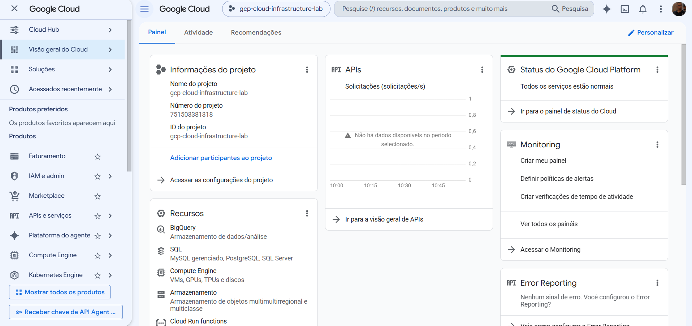

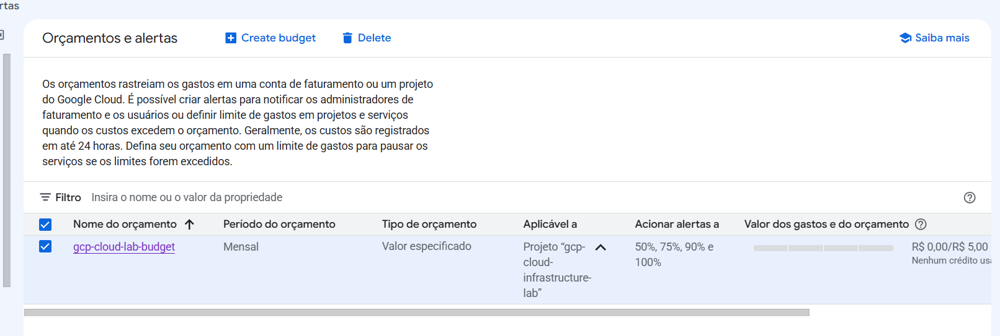

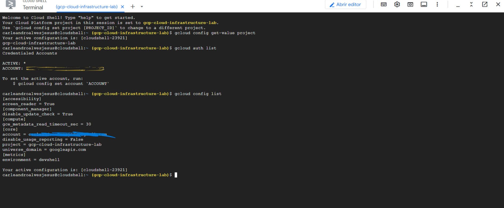

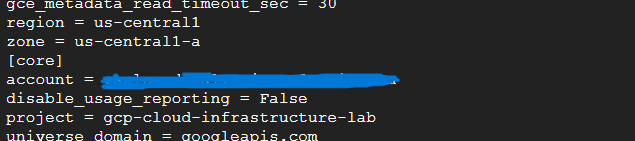

### Network and compute

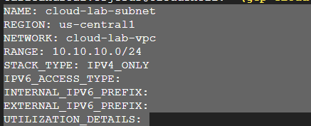

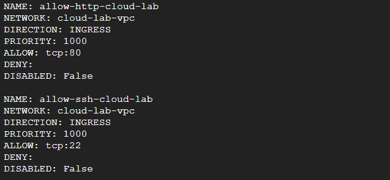

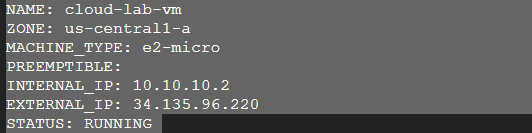

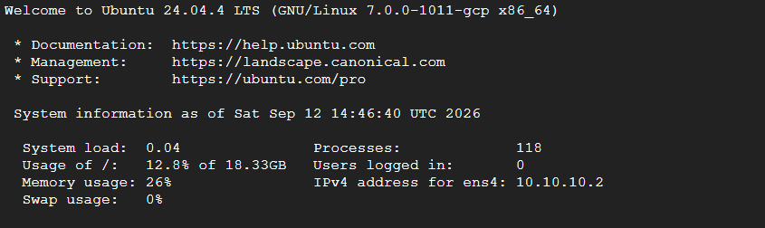

### Web server

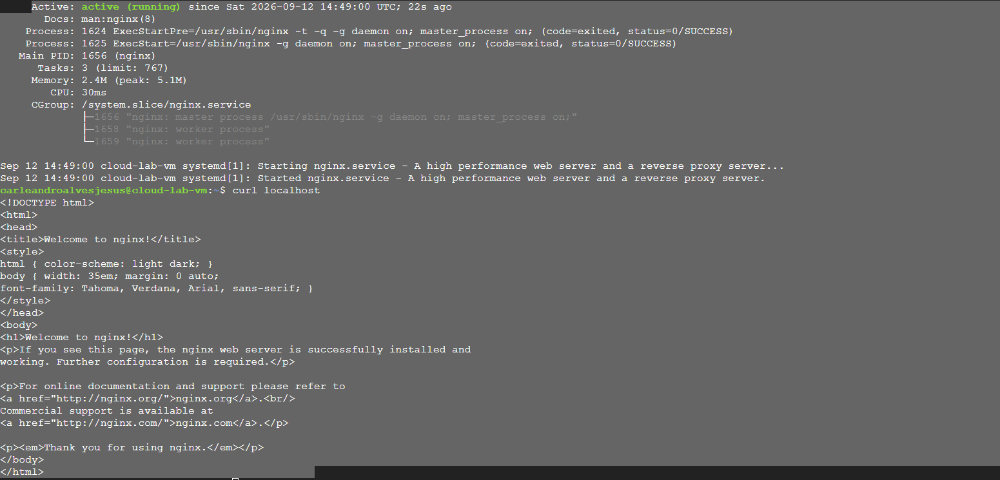

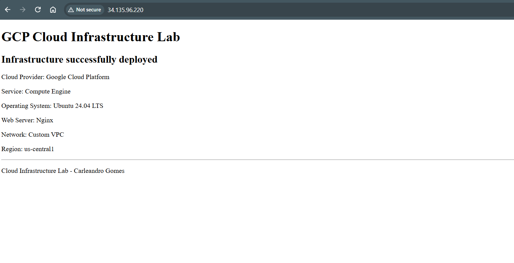

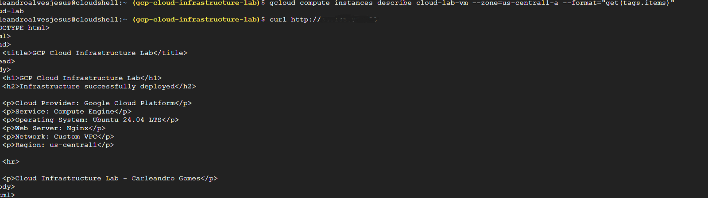

### Backup and IAM

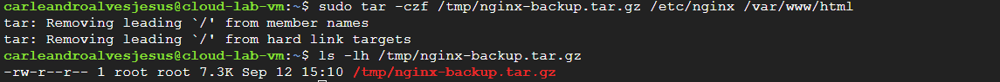

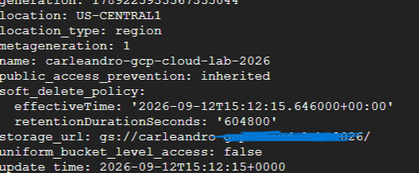

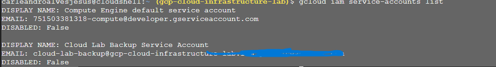

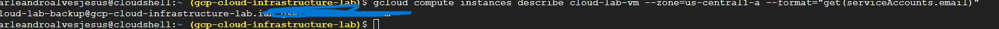

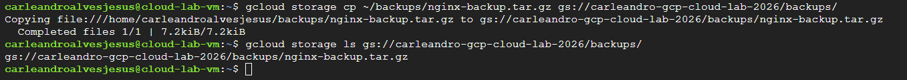

### Monitoring and logging

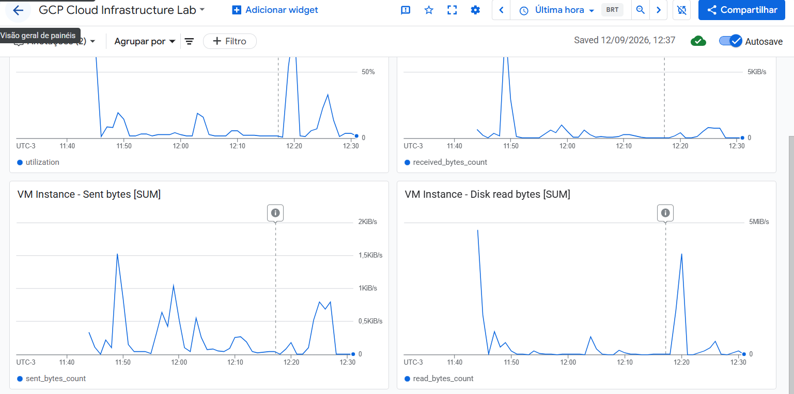

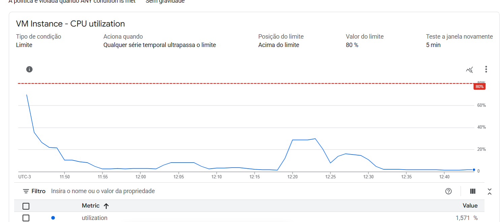

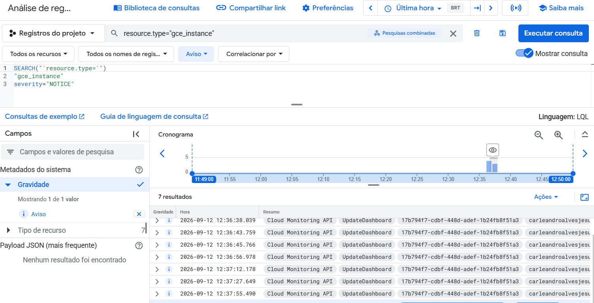

## Repository structure

```text
gcp-cloud-infrastructure-lab/
├── README.md
├── docs/
│   ├── architecture.md
│   ├── deployment.md
│   ├── security.md
│   └── troubleshooting.md
├── evidence/
│   └── README.md
└── scripts/
    └── backup.sh
```

## Deployment commands

The complete command sequence is documented in [`docs/deployment.md`](docs/deployment.md).

## Skills demonstrated

- Google Cloud Platform
- Compute Engine
- VPC networking
- Subnets and CIDR planning
- Firewall rules
- Linux administration
- Nginx
- IAM
- Service Accounts
- Cloud Storage
- Backup operations
- Cloud Monitoring
- Alerting
- Cloud Logging
- Troubleshooting
- Cost awareness

## Roadmap

- [x] V1 - Core infrastructure
- [x] Custom VPC and subnet
- [x] Compute Engine + Nginx
- [x] Cloud Storage backup
- [x] IAM / Service Account
- [x] Monitoring and Logging
- [ ] V2 - Terraform
- [ ] V3 - High availability and Load Balancer
- [ ] V4 - Docker and Artifact Registry
- [ ] V5 - GKE and CI/CD

## Author

**Carleandro Gomes**  
GitHub: [@gsleandro](https://github.com/gsleandro)
