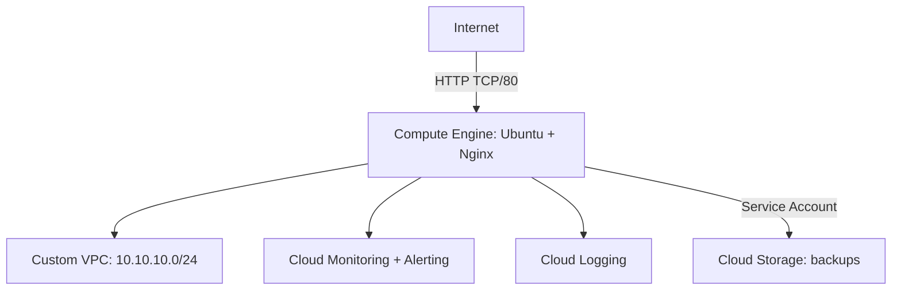

# GCP Cloud Infrastructure Lab


Hands-on Google Cloud infrastructure project focused on **networking, Compute Engine, Linux, IAM, Cloud Storage, monitoring, logging and backup operations**.

The lab simulates a small cloud environment deployed from scratch with a custom VPC, an Ubuntu VM running Nginx, controlled network access, a dedicated workload identity, backups to Cloud Storage and basic observability.

## Project status

**V1 complete.** The infrastructure was deployed, tested and documented with implementation evidence.

## Objectives

- Build a custom VPC and subnet instead of using the default network
- Deploy an Ubuntu VM on Compute Engine
- Publish an Nginx web service over HTTP
- Configure firewall rules for HTTP and SSH
- Use a dedicated Service Account for workload access
- Store Nginx backups in Cloud Storage
- Apply bucket-level IAM permissions
- Build a Cloud Monitoring dashboard and CPU alert
- Validate infrastructure logs in Cloud Logging
- Document troubleshooting and implementation evidence

## Architecture



> Cloud Storage is accessed through Google Cloud APIs using the VM's attached Service Account. It is not mounted as part of the VPC.

More details: [`docs/architecture.md`](docs/architecture.md)

## Resources deployed

| Resource | Configuration |
|---|---|
| Project | `gcp-cloud-infrastructure-lab` |
| Region | `us-central1` |
| Zone | `us-central1-a` |
| VPC | `cloud-lab-vpc` |
| Subnet | `cloud-lab-subnet` |
| CIDR | `10.10.10.0/24` |
| VM | `cloud-lab-vm` |
| Machine type | `e2-micro` |
| OS | Ubuntu 24.04 LTS |
| Web server | Nginx |
| Storage | Cloud Storage Standard |
| Service Account | `cloud-lab-backup` |
| CPU alert | Threshold above 80% for 5 minutes |

## Security decisions

The VM uses a dedicated Service Account instead of personal user credentials for backup access to Cloud Storage.

The initial bucket role was `roles/storage.objectCreator`. During validation, the CLI workflow required additional object permissions, so the lab was adjusted to bucket-level `roles/storage.objectUser`. The troubleshooting process is documented in [`docs/troubleshooting.md`](docs/troubleshooting.md).

> **Lab-only exposure:** TCP/22 is open from `0.0.0.0/0` for temporary SSH access. In production, SSH should be restricted by source CIDR or replaced with controls such as IAP and OS Login.

## Backup workflow

```text
/etc/nginx + /var/www/html
            |
            v
     compressed tar.gz
            |
            v
 gcloud storage upload
            |
            v
 Cloud Storage /backups
```

A reusable backup script is available at [`scripts/backup.sh`](scripts/backup.sh).

## Observability

The lab includes:

- VM CPU utilization
- Network received bytes
- Network sent bytes
- Disk activity
- VM uptime monitoring
- CPU alert policy
- Cloud Logging validation

## Troubleshooting highlights

Two useful operational issues were documented during the deployment:

1. **Cloud Storage HTTP 403** caused by insufficient object permissions on the Service Account.
2. **Backup file unavailable after restart** after initially using `/tmp`, leading to migration to a persistent path under `~/backups`.

See [`docs/troubleshooting.md`](docs/troubleshooting.md) for the full analysis.

## Evidence

Implementation evidence is stored in the `evidence/` directory and shown below in ascending filename order.

> Evidence 01 was not captured during the lab, so the published sequence starts at 02.

### Core setup

#### Evidence 02 — Project created


#### Evidence 03 — Budget alert


#### Evidence 04 — Cloud Shell project validation


#### Evidence 05 — Region and zone configuration


### Network and compute

#### Evidence 06 — VPC and subnet created


#### Evidence 07 — Firewall rules created


#### Evidence 08 — VM running


#### Evidence 09 — SSH access to Ubuntu VM


### Web server

#### Evidence 10 — Nginx running


#### Evidence 11 — Public Nginx web page


#### Evidence 12 — Public HTTP test


### Backup and IAM

#### Evidence 13 — Backup archive created


#### Evidence 14 — Cloud Storage bucket created


#### Evidence 15 — Service Account created


#### Evidence 16 — Service Account attached to VM


#### Evidence 17 — Backup uploaded to Cloud Storage


### Monitoring and logging

#### Evidence 18 — Monitoring dashboard


#### Evidence 19 — CPU alert policy


#### Evidence 20 — Cloud Logging


## Repository structure

```text
gcp-cloud-infrastructure-lab/
├── README.md
├── docs/
│   ├── architecture.md
│   ├── deployment.md
│   ├── security.md
│   └── troubleshooting.md
├── evidence/
│   ├── 02-project-created.png
│   ├── ...
│   ├── 20-cloud-logging.png
│   └── README.md
└── scripts/
    └── backup.sh
```

## Reproducing the lab

The command sequence used in the project is documented in [`docs/deployment.md`](docs/deployment.md).

## Skills demonstrated

- Google Cloud Platform
- Compute Engine
- Custom VPC networking
- Subnets and CIDR planning
- Firewall rules
- Linux administration
- Nginx
- IAM and Service Accounts
- Cloud Storage
- Backup operations
- Cloud Monitoring
- Alerting
- Cloud Logging
- Troubleshooting
- Cost-aware infrastructure design

## Roadmap

- [x] V1 — Core infrastructure
- [x] Custom VPC and subnet
- [x] Compute Engine + Nginx
- [x] Cloud Storage backup
- [x] IAM / Service Account
- [x] Monitoring and Logging
- [ ] V2 — Terraform
- [ ] V3 — High availability and Load Balancer
- [ ] V4 — Docker and Artifact Registry
- [ ] V5 — GKE and CI/CD

## Author

**Carleandro Gomes**  
GitHub: [@gsleandro](https://github.com/gsleandro)
